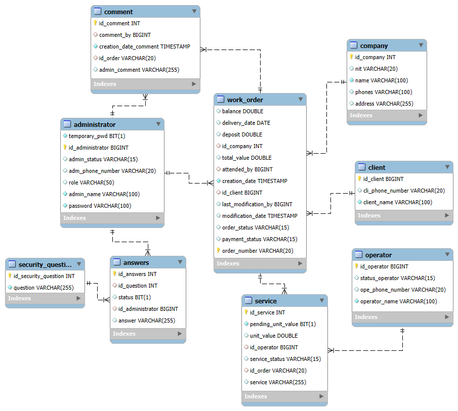
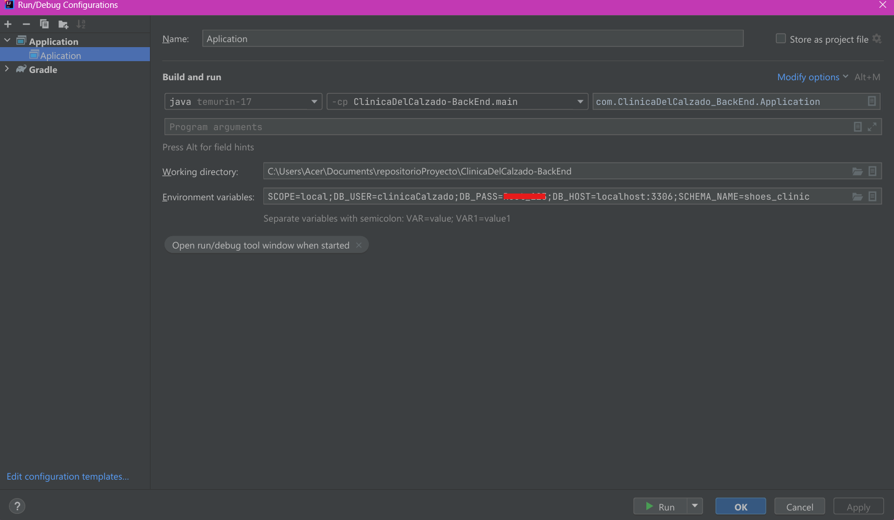

# CLÍNICA DEL CALZADO

# Backend Project

This project's objective is to implement a web application to automate the management of work orders for the Clínica del Calzado. This includes a secure authentication method, user management, work order handling, and generating general and detailed reports. The goal is to improve administrators' operational efficiency and ensure the accuracy of the reports.

# Technology:

  
  
  
  
  
  
  

# Team Members:
- Yury Ximena Alvarez Morantes 
- John Alejandro Avila Diaz
- Marielena Barrios Reinoso

# ER Diagram

# Run Locally

To run the application from your development IDE, you need to configure these environment variables.
- SCOPE=local (SCOPE=prod for production requests).
- DB_USER=${DB_USER} (Should be replaced with the user to access the database).
- DB_PASS=${DB_PASS} (Should be replaced with the password to access the database).
- DB_HOST=${DB_HOST} (Should be replaced with the hostname serving as the database repository).
- SCHEMA_NAME=${SCHEMA_NAME} (Should be replaced with the database schema name).   

  

©Copyright java-clínica-del-calzado-backend - 2024
